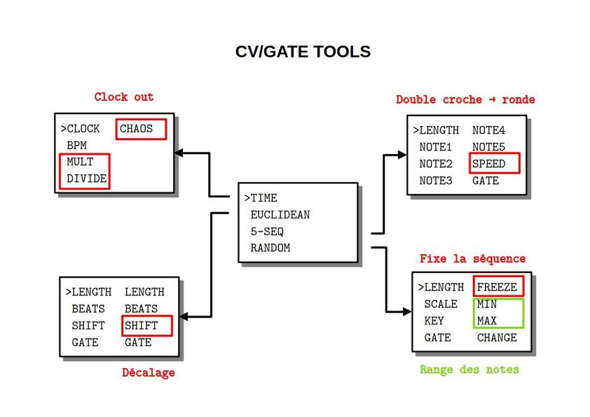

## PRÉSENTATION
Ce code permet au module CVGATE TOOLS de générer des CV et GATE suivant certains algorithmes. Il est autonome sur le rack et ne nécessite aucune entrée sauf éventuellement une horloge extérieure.

## MODE D'EMPLOI

À la mise sous tension les leds s'allument à tour de rôle puis l'écran affiche pendant quelques secondes un message d'information :

~~~~~~~
 RHYTHM BOX
 AND
 SEQUENCER
 vx.y.z
~~~~~~~
  
suivi du numéro de version.

Pour choisir un des algorithmes installés, il faut tourner l'encodeur PARAMETER au-dessus de l'écran.

~~~~~~~
>TIME
 EUCLIDEAN
 5-SEQ
 RANDOM
~~~~~~~

Ce même encodeur PARAMETER permet ensuite d'afficher la liste des paramètres par simple pression et de sélectionner le paramètre qu'on souhaite modifier.

~~~~~~~
 CLOCK  CHAOS
>BPM
 MULT
 DIVIDE
~~~~~~~

Une nouvelle pression permet de revenir à la liste des algorithmes.

Une fois le paramètre sélectionné, l'encodeur VALUE à gauche de l'écran permet d'en modifier la valeur. À noter qu'une rotation d'un seul cran de l'encodeur VALUE affiche la valeur sans la modifier. On modifie la valeur par rotation ou par pression suivant le type de paramètre.

~~~~~~~
 CLOCK  CHAOS
> 80
 MULT
 DIVIDE
~~~~~~~

**Reboot** : une pression longue sur l'encodeur PARAMETER affichant la liste redémarre le module.

## EUCLIDEAN

Cet algorithme génére deux rythmes euclidiens. Par chaque rythme :

* **LENGTH** nombre de double croches
* **BEATS** nombre de pas joués dans la séquence
* **SHIFT** nombre de double croches de décalage pour la séquence
* **GATE** durée du signal de 1 à 7 où 8 correspond à la durée de la double-croche

Les valeurs par défaut sont 16, 4, 0 et 2, 4

## RANDOM

Cet algorithme génére une séquence aléatoire de notes.

* **LENGTH** la longueur de séquence en double croches
* **FREEZE** boucle sur les dernières notes jouées (ON/OFF par pression)
* **MIN** la plus petite note (incluse) qu'on peut générer
* **MAX** la plus haute note (exclus) qu'on peut générer
* **KEY** choix de la tonalité
* **SCALE** la gamme de la tonalité
* **GATE** longueur en PPQN (1 / 6 de double croche) de 1 à 5
* **CHANGE** modifie la séquence gelée par substitution à l'octave/quinte

Les valeurs par défaut sont 0, OFF, C0, C5, C, CHROMA et 4.

_Remarques_

* les gammes sont la gamme chromatique, majeure, pentatonique majeure, mineure harmonique
* les notes sont prises uniformément dans l'échantillon par exemple pout une pentatonique en C entre C2 et E2, on a une chance sur deux d'avoir C2 ou D2
* si la longueur est nulle alors aucune note n'est générée
* une pression sur MIN ou MAX ramène aux valeurs par défaut

## 5-SEQ

Cet algorithme est un séquenceur d'au plus 6 pas.

* **LENGTH** la longueur de la séquence en double croches de 0 à 6
* **GATE** durée du signal de 1 à 9 où 10 correspond à la durée de la double-croche
* **SPEED** divise le tempo par 1, 2,..., 16
* **NOTE 1** pitch de la note 1
* **NOTE 2** pitch de la note 2
* **NOTE 3** pitch de la note 3
* **NOTE 4** pitch de la note 4
* **NOTE 5** pitch de la note 5

Les valeurs par défaut sont 0, 4, 1, C0, C1,..., C4

_Remarques_

* une pression permet d'activer/désactiver la note
* quand DIVIDE vaut 16 on a une note par mesure

## TIME

Cet algorithme gère tout l'aspect lié au temps. Par exemple on peut décider si l'outil envoie un signal d'horloge (24 PPQN) ou pas. 

* **CLOCK** synchronisation sur l'entrée ou pas (EXTERN/INTERN par pression) 
* **BPM** indique le tempo pour l'horloge externe ou règle de tempo pour l'horloge interne entre 30 et 240 bpm
* **MULT** multiplie le tempo par 1, 2, 3 ou 4 permettant de générer un effet stutter
* **DIVIDE** divise le tempo par 1, 2, 3 ou 4 
* **CHAOS** de 0 (aucun trigger) à 10 (tous les triggers). C'est une sortie aléatoire
 
Les valeurs par défaut sont INTERN, 120, 1 et 1.

_Remarques_

* le bpm affiché est entier ce qui signifie qu'il est arrondis pour un signal entrant et qu'il n'est pas possible de lui donner une valeur décimale lorsqu'il est généré

## MISE À JOUR

En cas de :

* correction de bugs
* ajout de fonctionnalités

le dernier firmware au format Intel HEX sera toujours à votre disposition sur le site [CIYLab](https://ciylab.com).

Pour le développement de votre propre code, il est conseillé de retirer le micro-controleur et de le remplacer par le vôtre. 

Vous pouvez notifier tout dysfonctionnement par email avec le protocole précis permettant sa reproductabilité à l'adresse <contact@ciylab.com>.

## DONNÉES TECHNIQUES

**Alimentation** :

* Bus Eurorack : +12v 40mA

**Dimensions** :

* largeur : 12HP
* profondeur : 27mm

**Librairies** :

* SPI                     1.0
* Versatile_RotaryEncoder 1.3.1
* U8g2                    2.35.30
* Wire                    1.0

**Plateforme** :

* thinary:avr   1.0.0
