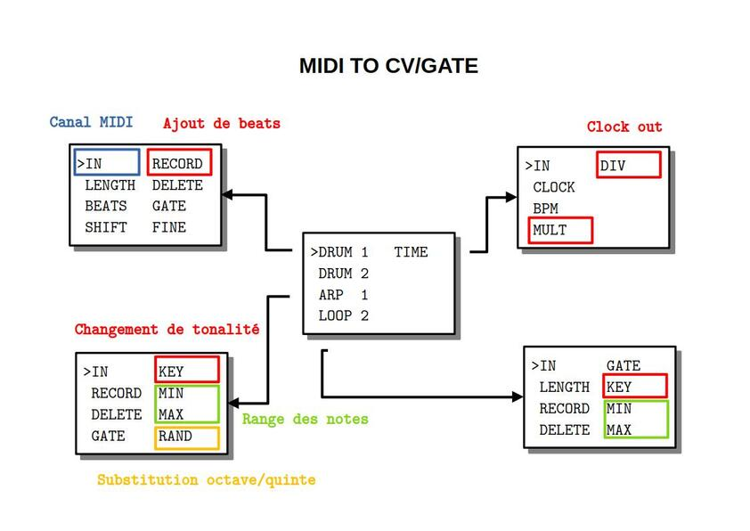

## PRÉSENTATION
Ce code permet d'utiliser une entrée MIDI sur le module MIDI2CVGATE pou générer des CV et GATE avec la possibilité d'enregistrer ce qui sort du clavier.

## MODE D'EMPLOI
À la mise sous tension les leds s'allument à tour de rôle pendant que l'écran affiche pendant quelques secondes un message d'information :

~~~~~~~
 MIDI
 TO 
 CV/GATE
 vx.y.z
~~~~~~~

suivi du numéro de version.

Pour choisir un des algorithmes installés, il faut tourner l'encodeur PARAMETER au-dessus de l'écran.

~~~~~~~
>DRUM 1  TIME
 DRUM 2
 ARP 1
 LOOPER 2
~~~~~~~

Ce même encodeur PARAMETER permet ensuite d'afficher la liste des paramètres par simple pression et de sélectionner le paramètre qu'on souhaite modifier.

~~~~~~~
 IN      DIVIDE
 CLOCK
>BPM
 MULT
~~~~~~~

Une nouvelle pression permet de revenir à la liste des algorithmes.

Une fois le paramètre sélectionné, l'encodeur VALUE à gauche de l'écran permet d'en modifier la valeur. À noter qu'une rotation d'un seul cran de l'encodeur VALUE affiche la valeur sans la modifier. On modifie la valeur par rotation ou par pression suivant le type de paramètre.

~~~~~~~
 IN      DIVIDE
 CLOCK
> 80
 MULT
~~~~~~~

**Reboot** : une pression longue sur l'encodeur PARAMETER affichant la liste redémarre le module.

**Program Change** : le module réagit aux messages PC

**Control Change** : le module réagit aux messages CC dont le numéro de 2 à 8 est celui du paramètre sur le canal midi. Le numéro de canal midi ne peut être changé que manuellement.

## ARP

Cet algorithme joue l'arpège des notes enregistrées. On peut l'utiliser comme séquenceur.

* **IN** canal MIDI en entrée (OFF, 1 à 16)
* **RECORD** enregistrement (ON/OFF par pression) des notes une à une
* **DELETE** efface les notes enregistrées
* **GATE** longueur en PPQN (1/6 de double croche) de 1 à 5
* **KEY** transpose à la volée en ajoutant un intervalle de 0 à 11 demi-tons à la note
* **MIN** ignore les notes dont le pitch est inférieur
* **MAX** ignore les notes dont le pitch est supérieur ou égal
* **CHANGE** probabilité en % de modifier aléatoirement des notes par leur quinte ou octave au dessus ou au dessous)

Les valeurs par défaut sont OFF, OFF, OFF, 2/6, C, C0, C5 et 0.

_Remarques_

* la longueur de l'arpège est égal au nombre de notes enregistrées
* les notes sont jouées à la double-croche
* un nouvel enregistrement s'ajoute au précédent
* lorsque la probabilité de jouer l'arpège vaut 0%, le choix de la note de substitution est uniforme sur les 5 possibilités

## DRUM

Cet algorithme joue l'arpège des notes enregistrées. On peut l'utiliser comme séquenceur.

* **IN** canal MIDI en entrée (OFF, 1 à 16)
* **LENGTH** la longueur de la séquence en double croches
* **BEATS** nombre de beats dans la séquence
* **SHIFT** décalage en double-croches
* **RECORD** enregistrement (ON/OFF) de beats supplémentaires
* **DELETE** efface les beats ajoutés
* **GATE** longueur en PPQN (1/6 de double croche) de 1 à 5
* **FINE** avance/retard de 0 à 3 PPQN

Les valeurs par défaut sont OFF, 16, 4, 0, OFF, OFF, 2/6, 0.

_Remarques_

* un nouvel enregistrement s'ajoute au précédent

## LOOPER

Cet algorithme enregistre et joue la boucle de notes entrées.

* **IN** canal MIDI en entrée (OFF, 1 à 16)
* **LENGTH** la longueur de la boucle en double croches
* **RECORD** enregistre les notes (ON/OFF par pression)
* **DELETE** efface toute la boucle
* **GATE** entre 1/6 et 5/6 de double-croche
* **KEY** transpose à la volée en ajoutant un intervalle de 0 à 11 demi-tons à la note

Les valeurs par défaut sont OFF, 16, OFF, OFF, 2/6 et C.

_Remarques_

* le jeu est quantifié en 24 PPQN
* les notes s'ajoutent à la séquence à chaque enregistrement
* le jeu est monophonique

## TIME

Ce module gère la sortie d'horloge.

* **IN** numéro de canal MIDI pour les messages CC
* **CLOCK** envoie d'un signal interne (ON) ou réception MIDI (OFF)
* **BPM** indique le tempo pour l'horloge externe ou règle de tempo pour l'horloge interne entre 30 et 240 bpm
* **MULT** multiplie la vitesse du siganl de sortie par 2, 3 ou 4
* **DIV** divise la vitesse du siganl de sortie par 2, 3 ou 4

Les valeurs par défaut sont ON, 120, 1 et 1.

_Remarques_

* la sortie peut être utilisée comme métronome/kick 
* le bpm affiché est entier ce qui signifie qu'il est arrondi pour un signal entrant et qu'il n'est pas possible de lui donner une valeur décimale lorsqu'il est généré

## MISE À JOUR

En cas de :

* correction de bugs
* ajout de fonctionnalités

le dernier firmware au format Intel HEX sera toujours à votre disposition sur le site [CIYLab](https://ciylab.com).

Pour le développement de votre propre code, il est conseillé de retirer le micro-controleur et de le remplacer par le vôtre. 

Vous pouvez notifier tout dysfonctionnement par email avec le protocole précis permettant sa reproductabilité à l'adresse <contact@ciylab.com>.

## DONNÉES TECHNIQUES

**Alimentation** :

* Bus Eurorack : +12v 31mA

**Dimensions** :

* largeur : 12HP
* profondeur : 27mm

**Librairies** :

* MIDI Library            5.0.2
* SPI                     1.0
* Versatile_RotaryEncoder 1.3.1
* U8g2                    2.35.30 
* Wire                    1.0

**Plateforme** :

* arduino:avr             1.8.6
* arduino:megaavr         1.8.8
* thinary:avr             1.0.0 
