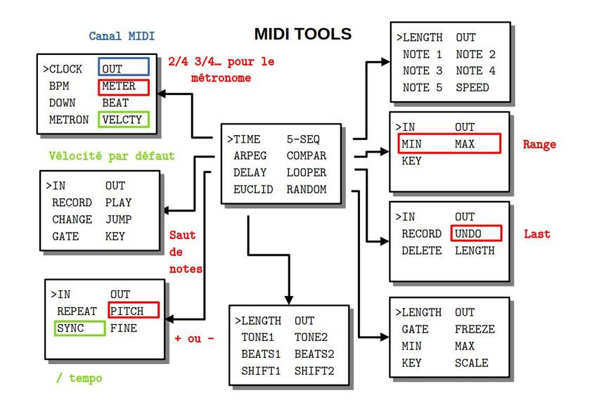

## PRÉSENTATION
Ce code permet de générer ou modifier des signaux MIDI entrants. 

## MODE D'EMPLOI
À la mise sous tension, l'écran affiche pendant quelques secondes un message d'information :

~~~~~~~
  MIDI TOOLS
  FOR SYNTH
  BY CIYLAB
  VX.Y.Z
~~~~~~~
  
suivi du numéro de version.

Pour choisir un des algorithmes installés, il faut tourner l'encodeur PARAMETER au-dessus de l'écran.

~~~~~~~
>TIME    5-SEQ 
 ARPEGG  COMPAR
 DELAY   LOOPER
 EUCLID  RANDOM 
~~~~~~~

Ce même encodeur PARAMETER permet ensuite d'afficher la liste des paramètres par simple pression et de sélectionner le paramètre qu'on souhaite modifier.

~~~~~~~
 IN      OUT
>UNDO    RECORD
 DELETE  LENGTH

~~~~~~~

Une nouvelle pression permet de revenir à la liste des algorithmes.

Une fois le paramètre sélectionné, l'encodeur VALUE en dessous de l'écran permet d'en modifier la valeur. À noter qu'une rotation d'un seul cran de l'encodeur VALUE affiche la valeur sans la modifier. On modifie la valeur par rotation ou par pression suivant le type de paramètre.

~~~~~~~
 IN      OUT
>OFF     RECORD
 DELETE  LENGTH

 ~~~~~~~

**MIDI panic** : même si le code ne devrait pas le permettre, il peut arriver qu'un message de note on soit envoyé mais pas le message de note off correspondant. Pour remédier à ce problème une pression longue sur l'encodeur VALUE envoie les 127 note off sur le canal de sortie de l'algorithme sélectionné.

**Silence** : Une pression sur l'encodeur VALUE pour le canal de sortie OUT permet de fermer temporairement le canal.

**Reboot** : une pression longue sur l'encodeur PARAMETER redémarre le module.

**Program Change** : le module réagit aux messages PC

**Control Change** : le module réagit aux messages CC dont le numéro est celui du paramètre. Par exemple le CC 2 gère le numéro de canal de sortie de l'algorithme sélectionné. Le paramètre concerné ne dépend pas du canal midi.

## ARPEGG

Cet algorithme joue l'arpège des notes enregistrées.

* **IN** canal MIDI en entrée (OFF, 1 à 16)
* **OUT** canal MIDI en sortie (OFF,1 à 16)
* **RECORD** enregistrement (ON/OFF par pression) des notes une à une
* **PLAY** lancement de l'arpège (ON/OFF par pression)
* **CHANGE** probabilité en % de modifier aléatoirement des notes par leur quinte ou octave au dessus ou au dessous)
* **JUMP** probabilité en % de ne pas jouer un pas
* **GATE** longueur en PPQN (1 / 6 de double croche) de 1 à 5
* **KEY** on ajoute un intervalle de 0 à 11 demi-tons à la note

Les valeurs par défaut sont OFF, OFF, OFF, OFF, 0%, 0%, 3 et 0.

_Remarques_

* une fois la séquence enregistrée, elle peut être exécutée par trigger externe
* la longueur de l'arpège est égal au nombre de notes enregistrées
* les notes sont jouées à la double-croche
* un nouvel enregistrement efface le précédent
* lorsque la probabilité de jouer l'arpège vaut 0%, le choix de la note de substitution est uniforme sur les 5 possibilités
* lorsque la probabilité de ne pas jouer un pas vaut 100%, alors l'arpège est ignoré
* on ne peut pas enregistrer et jouer en même temps

## COMPAR

Cet algorithme ne joue que les notes entrées dans un intervalle donnée.

* **IN** canal MIDI en entrée (OFF, 1 à 16)
* **OUT** canal MIDI en sortie (OFF,1 à 16)
* **MIN** toute note entrée dont le pitch est strictement inférieur n'est pas jouée 
* **MAX** toute note entrée dont le pitch est supérieur au sens large n'est pas jouée
* **KEY** on ajoute un intervalle de 0 à 11 demi-tons à la note entrée 

Les valeurs par défaut sont OFF, OFF, C2, C5 et C.

_Remarques_

* le minimum possible est C2
* le maximum possible est C5 
* par défaut C2 est jouée mais pas C5 
* la transposition est effectuée après la comparaison donc si on ajoute une
 quinte à B5 alors la note transposée est jouée mais si on ajoute une quinte à B1 alors la note n'est pas jouée

 

## DELAY

Cet algorithme répète une note entrée. La vélocité diminue au fur et à mesure des répétitions.

* **IN** canal MIDI en entrée (OFF, 1 à 16)
* **OUT**  canal MIDI en sortie (OFF,1 à 16)
* **REPEAT** nombre de répétitions de 0 à 3
* **PITCH** augmentation ou diminution du pitch à chaque répétition en demi-tons
* **SYNC** la durée en fraction de noire entre deux répétitions
* **FINE** nombre de milliseconds (max 10) en plus ou en moins entre deux répétitions

Les valeurs par défaut sont OFF, OFF, 1, 0, 1/2 et 0.

_Remarques_

* pour un synthétiseur monophonique le delay peut fournir un son inattendu à cause de la simultanéité des notes jouées

## EUCLIDEAN

Cet algorithme génére deux rythmes euclidiens sur un même canal midi.

* **LENGTH** nombre de double croches
* **OUT**  canal MIDI en sortie (OFF,1 à 16)
* **TONE1** pitch de la première séquence
* **TONE2** pitch de la deuxième séquence
* **BEATS1** nombre de pas pour la première séquence valant momentanément 0 par pression
* **BEATS2** nombre de pas pour la deuxième séquence valant momentanément 0 par pression
* **SHIFT1** nombre de double croches de décalage pour la première séquence
* **SHIFT2** nombre de double croches de décalage pour la première séquence

Les valeurs par défaut sont 16, OFF, C1, G1, 4, 4, 0 et 2.

_Remarques_

* la longueur est commune aux deux séquences
* si deux notes tombent sur le même beat, seule celle de la première séquence est jouée

## LOOPER

Cet algorithme enregistre et joue la boucle de notes entrées.

* **IN** canal MIDI en entrée (OFF, 1 à 16)
* **OUT**  canal MIDI en sortie (OFF,1 à 16)
* **RECORD** enregistre les notes (ON/OFF par pression)
* **UNDO** efface le précédent enregistrement (ON/OFF par pression)
* **DELETE** efface toute la boucle
* **LENGTH** la longueur de la boucle en double croches

Les valeurs par défaut sont OFF, OFF, OFF, OFF et 16.

_Remarques_

* le jeu est quantifié sur les 24 PPQN par noire
* les notes s'ajoutent à la séquence à chaque enregistrement

## RANDOM

Cet algorithme génére une séquence aléatoire de notes.

* **LENGTH** la longueur de séquence en double croches
* **OUT**  canal MIDI en sortie (OFF,1 à 16)
* **GATE** longueur en PPQN (1 / 6 de double croche) de 1 à 5
* **FREEZE** boucle sur les dernières notes jouées (ON/OFF par pression)
* **MIN** la plus petite note qu'on peut générer
* **MAX** la plus haute note qu'on peut générer
* **KEY** choix de la tonalité
* **SCALE** la gamme de la tonalité

Les valeurs par défaut sont 3, OFF, 0, OFF, C2, C5, C et CHROMA.

_Remarques_

* les gammes sont la gamme chromatique, majeure, pentatonique majeure, mineure harmonique
* les notes sont prises uniformément dans l'échantillon par exemple pout une pentatonique en C entre C2 et E2, on a une chance sur deux d'avoir C2 ou D2
* si la longueur est nulle alors aucune note n'est générée

## 5-SEQ

Cet algorithme est un séquenceur d'au plus 5 pas.

* **LENGTH** la longueur de la séquence en double croches de 0 à 5
* **OUT**  canal MIDI en sortie (OFF,1 à 16)
* **NOTE 1** pitch de la note 1
* **NOTE 2** pitch de la note 2
* **NOTE 3** pitch de la note 3
* **NOTE 4** pitch de la note 4
* **NOTE 5** pitch de la note 5
* **SPEED** vitesse d'exécution de la séquence par rapport au tempo. Une vitesse :4 joue une noire

Les valeurs par défaut sont 0, OFF, C2 pour toutes les notes et :1.

_Remarques_

* une pression permet d'activer/désactiver la note

## TIME

Cet algorithme gère tout l'aspect lié au temps. Par exemple on peut décider si l'outil envoie un signal d'horloge (24 PPQN) ou pas. 

* **CLOCK** envoie d'un signal ou pas (EXT/INT par pression) 
* **OUT**  canal MIDI en sortie pour le métronome (OFF,1 à 16)
* **BPM** indique le tempo pour l'horloge externe ou règle de tempo pour l'horloge interne entre 30 et 240 bpm
* **METER** donne la signature en nombre de noires de 0 à 6 par mesure de 4 temps 
* **DOWN** pitch de la première note de la mesure
* **BEAT** pitch pour les autres temps
* **METRON** active le métronome (ON/OFF par pression) 
* **VELCTY** valeur commune de la vélocité pour les modules qui n'utilisent pas l'entrée MIDI

Les valeurs par défaut sont EXT, OFF, 120, 0, C5, C2, OFF et 100.

_Remarques_

* le métronome peut être utilisé pour un kick 
* le bpm affiché est entier ce qui signifie qu'il est arrondis pour un signal entrant et qu'il n'est pas possible de lui donner une valeur décimale lorsqu'il est généré

## MISE À JOUR

En cas de :

* correction de bugs
* ajout de fonctionnalités

le dernier firmware au format Intel HEX sera toujours à votre disposition sur le site [CIYLab](https://ciylab.com).

Pour le développement de votre propre code, il est conseillé de retirer le micro-controleur et de le remplacer par le vôtre. 

Vous pouvez notifier tout dysfonctionnement par email avec le protocole précis permettant sa reproductabilité à l'adresse <contact@ciylab.com>.

## DONNÉES TECHNIQUES

**Alimentation** :

* Bus Eurorack : +12v 23mA

**Dimensions** :

* largeur : 8HP
* profondeur : 27mm

**Librairies** :

* MIDI Library            5.0.2
* SPI                     1.0
* Versatile_RotaryEncoder 1.3.1
* U8g2                    2.35.30 
* Wire                    1.0

**Plateforme** :

* arduino:megaavr         1.8.8
* thinary:avr             1.0.0 
