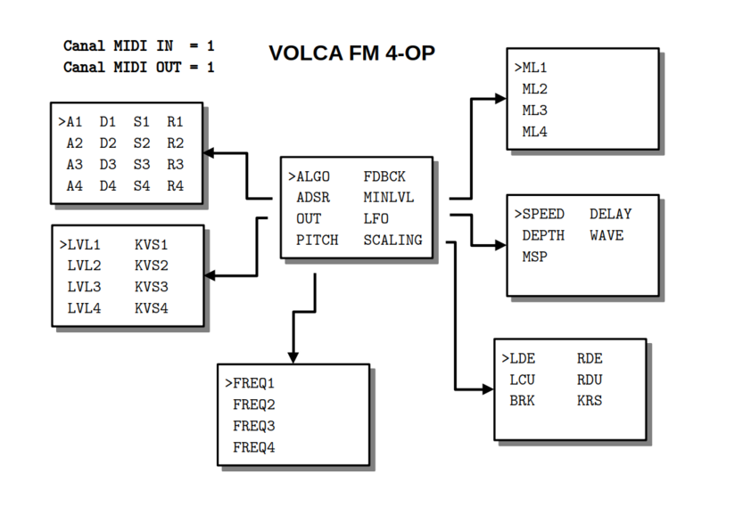
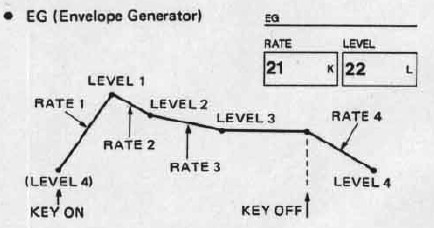

## PRÉSENTATION
Le code permet au module MIDI TOOLS de modifier, par NPRN, 59 des 156 paramètres du Volca FM sous firmware 1.09, réduit à 4-OP pour simplifier la maîtrise FM sur le modèle du Yamaha FB-01. Un contrôleur MIDI externe peut aussi être utilisé (CC1 à CC59).

## MODE D'EMPLOI
À la mise sous tension, l'écran affiche pendant quelques secondes un message d'information finissant par le numéro de version :

~~~~~~~
 SEND SYSEX TO   
 VOLCA FM 4-OP   
 BY CIYLAB       
 vx.y.z
~~~~~~~

Pour choisir les paramètres, il faut tourner l'encodeur PARAMETER au-dessus de l'écran.

~~~~~~~
 ALGO    FDBCK   
 ADSR    MINLVL  
 OUT    >LFO     
 PITCH   SCALING
~~~~~~~

Ce même encodeur PARAMETER permet (sauf pour le choix de l'algorithme et du feedback) d'afficher la liste des paramètres par simple pression et de sélectionner le paramètre qu'on souhaite modifier.

~~~~~~~
>SPEED   DELAY   
 DEPTH   WAVE    
 PMS

~~~~~~~

Une nouvelle pression permet de revenir au menu principal.

Une fois le paramètre sélectionné, l'encodeur VALUE en dessous de l'écran permet d'en modifier la valeur. À noter qu'une rotation d'un seul cran de l'encodeur VALUE affiche la valeur sans la modifier. Une pression sur cet encodeur affiche le nom du paramètre.

**Reboot** : une pression longue sur l'encodeur PARAMETER redémarre le module.

**Control Change** : le module réagit aux messages CC dont le numéro est celui de l'un des 45 paramètres. Par exemple le CC 2 gère la quantité de feedback.

## FDBCK

Le niveau de ré-insertion du signal. Provoque en général une saturation assimilable à du bruit.

## ADSR

Cette page gère l'enveloppe pour chacun des 4 opérateurs :

* **A** plus la valeur est élevée pour l'attaque est rapide 
* **D** règle la durée de la chute de l'attaque
* **S** règle le niveau de la tenue
* **R** règle la pente du relachement

Les valeurs par défaut sont 99, 99, 99 et 0.

_Remarques_

* une enveloppe de DX7 (volca FM) dépend de 8 paramètres.

Ici nous choissisons A = R1, D = R2, S = L3, R = R4, L2 = L3 et R3 = 0. Le volume minimal est L4 (paramètre de la page MINLVL) initialisé au maximum pour un son tenue comme sur un synthétiseur analogique.

## ALGO

Pour le choix de l'un des 8 algorithmes, le premier par défaut.

### Correspondance des numéros d'algorithme

Les opérateurs 1 et 2 du volca sont désactivés

| FB-01 | volca FM |
|------:|---------:|
|1|1|
|2|14|
|3|8|
|4|7|
|5|5|
|6|22|
|7|31|
|8|32|

### Affichage oled 

#### algorithme 1
~~~~~~~
      4]
    2-3
    1
    *
~~~~~~~

#### algorithme 2
~~~~~~~
      4]
    3-2
      1
      *
~~~~~~~

#### algorithme 3
~~~~~~~
    4
    3
    1-2]
    *
~~~~~~~

#### algorithme 4
~~~~~~~
    4]
    3
    1-2
    *
~~~~~~~

#### algorithme 5
~~~~~~~

    2  4]
    1  3
    *  *
~~~~~~~

#### algorithme 6
~~~~~~~

       4]
    1  2  3
    *  *  *
~~~~~~~

#### algorithme 7
~~~~~~~

          4]
    1  2  3
    *  *  *
~~~~~~~

#### algorithme 8
~~~~~~~

    1  2  3  4]
    *  *  *  *
~~~~~~~

## LFO

Cette page gère l'action du LFO sur le pitch (effet de vibrato) :

* **SPEED** vitesse 
* **DELAY** durée avant activation
* **DEPTH** amplitude
* **WAVE** forme de l'enveloppe
* **MSP** sensibilité 

Les valeurs par défaut sont nulles.

_Remarques_

* si la sensibilité est nulle alors aucune modulation n'est appliquée
* l'enveloppe 5 est aléatoire

## MINLVL

Cette page gère le niveau minimum du son avant et après l'application de l'enveloppe (paramètre L4 du DX7). La valeur 0 correspond au cas classique où le son n'est produit que pendant la durée de l'enveloppe. La valeur maximum de 99 correspond au cas où la durée du son est infinie.

## OUT

Cette page gère le niveau de sortie pour chaque opérateurs. Le résultat audio est défférent s'il s'agit d'une porteuse ou d'un modulateur. 

* **LVL** le niveau de sortie
* **KVS** sensibilité au clavier (0 = amplitude indépendante toujours au maximum)

Les valeurs par défaut sont 99 et 0.

## PITCH 

Cette page gère le rapport des fréquences pour chaque opéateurs. 

* **FREQ** le rapport des fréquences

Les valeurs par défaut sont 0 correspondant à l'octave inférieure.

## SCALING 

Cette page gère l'amplitude sonore en fonction de la position de la note par rapport à une note de référence (break point)

* **LDE** le niveau gauche 
* **RDE** le niveau droit
* **LCU** la courbe gauche de sensibilité
* **RCU** la courbe droite de sensibilité
* **BRK** note de référence
* **KRS** sensibilité au clavier 

Les valeurs par défaut sont nulles.

_Remarques_

* par exemple si on monte RDE alors les notes à droite de BRK seront moins audible.
* le réglage ne porte que sur le premier opérateur en général porteur.

## MISE À JOUR

En cas de :

* correction de bugs
* ajout de fonctionnalités

le dernier firmware au format Intel HEX sera toujours à votre disposition sur le site [CIYLab](https://ciylab.com).

Pour le développement de votre propre code, il est conseillé de retirer le micro-controleur et de le remplacer par le vôtre. 

Vous pouvez notifier tout dysfonctionnement par email avec le protocole précis permettant sa reproductabilité à l'adresse <contact@ciylab.com>.

## DONNÉES TECHNIQUES

**Alimentation** :

* Bus Eurorack : +12v 23mA

**Dimensions** :

* largeur : 8HP
* profondeur : 27mm

**Librairies** :

* MIDI Library            5.0.2
* SPI                     1.0
* Versatile_RotaryEncoder 1.3.1
* U8g2                    2.35.30 
* Wire                    1.0

**Plateforme** :

* arduino:megaavr         1.8.8
* thinary:avr             1.0.0 
